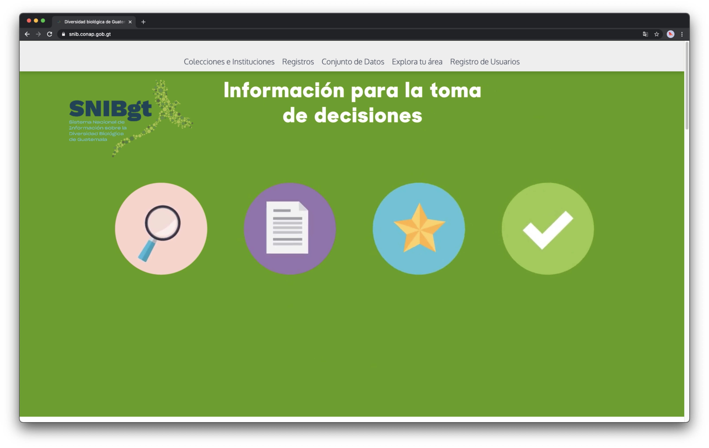

## {{ page.institution }}

#### Description 
Add description

#### Resources

- Code: ?
- End-User documentation: ?
- Documentation: ?
- Twitter Account: ?

#### Modules Available 

| Name              | Link                                                                                   | 
| ------------------|----------------------------------------------------------------------------------------|
| Collectory		| [https://snib.conap.gob.gt/colecciones](https://snib.conap.gob.gt/colecciones)         |
| Biocache          | [https://snib.conap.gob.gt/registros](https://snib.conap.gob.gt/registros)             |
| Biocache Service  | [https://snib.conap.gob.gt/registros-ws](hhttps://snib.conap.gob.gt/registros-ws)      |
| Species           | [https://snib.conap.gob.gt/especies](https://snib.conap.gob.gt/especies)               |
| Species service   | [https://snib.conap.gob.gt/especies-ws](https://snib.conap.gob.gt/especies-ws)         | 
| Species list      | [https://snib.conap.gob.gt/listas](https://snib.conap.gob.gt/listas)                   |  
| Regions           | [https://regiones.snib.conap.gob.gt/](https://regiones.snib.conap.gob.gt/)             |
| Images            | [https://imagenes.snib.conap.gob.gt/](https://imagenes.snib.conap.gob.gt/)             |
| Spatial           | [https://geoespacial.snib.conap.gob.gt/](https://geoespacial.snib.conap.gob.gt/)       |
| CAS               | [https://aut.snib.conap.gob.gt/cas](https://aut.snib.conap.gob.gt/cas)                 |
| Logger            | [https://snib.conap.gob.gt/logger/](https://snib.conap.gob.gt/logger/)                 |
| User details      | [https://aut.snib.conap.gob.gt/userdetails](https://aut.snib.conap.gob.gt/userdetails) |

For more information, you may contact Hector Hernandez on Slack.
