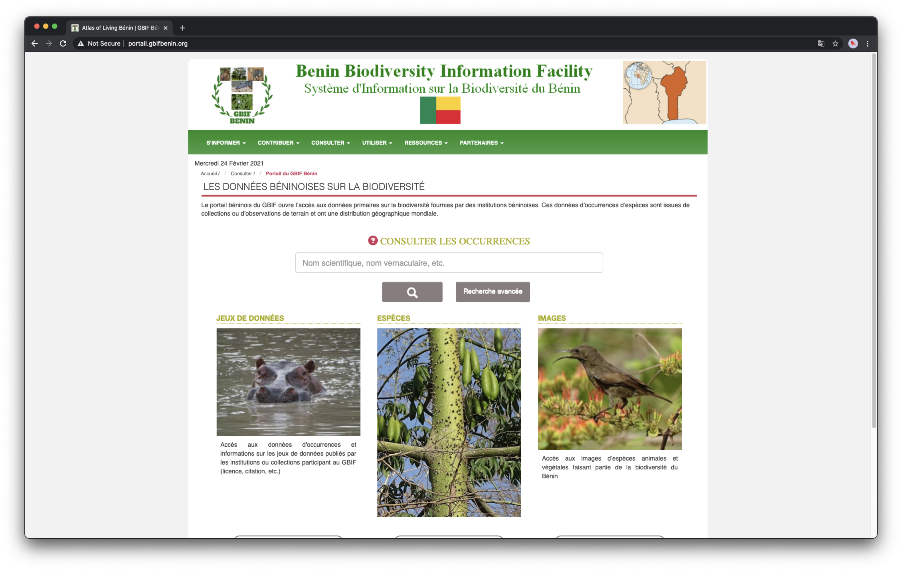

## {{ page.institution }}

#### Description 

The GBIF Benin portal can be found here: [http://portail.gbifbenin.org/](http://portail.gbifbenin.org/)

It is a Hub of the data portal of the GBIF France.

The GBIF France team was in charge of the development and put only one developer to configure and install the Benin Hub, helping in that by Koura Kourouma from the GBIF Benin Team.

#### Resources

- Code: ?
- End-User documentation: ?
- Documentation: ? 
- Twitter Account: ?

#### Modules Available 

| Name              | Link                                                                       | 
| ------------------|----------------------------------------------------------------------------|

For more information, you may contact Kourouma Koura on Slack.
