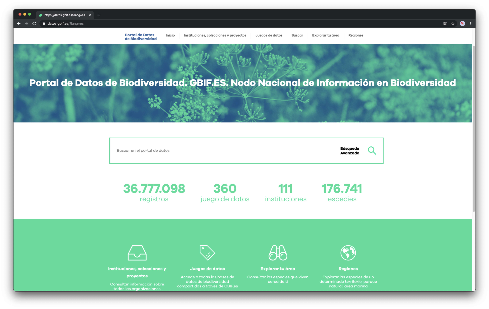

## {{ page.institution }}

#### Description 
Our main infrastructure is hosted in the [CSIC-IFCA datacenter](https://ifca.unican.es/en-us/about-ifca/infrastructure).

You can get some similar inventories from [https://generator.l-a.site/5332d9ba-97d5-4940-b262-c29c1703968d](https://generator.l-a.site/5332d9ba-97d5-4940-b262-c29c1703968d) (press Hamburger top menu > Make a copy > Edit the copy to your needs).

The Spanish Atlas is accessible at [https://datos.gbif.es/](https://datos.gbif.es/)

#### Resources

- Code: [GBIF Spain GitHub account](https://github.com/GBIFes)
- Documentation: 
- End-user documentation: [GBIF.ES Training Guide: How to search, refine and download data from the gbif.es biodiversity data portal](https://www.gbif.es/wp-content/uploads/2020/07/online-exercises-gbifes-atlas-en.pdf)
- End-user documentation: [Ejercicios: Uso del Portal de Datos de Biodiversidad de GBIF.ES](https://www.gbif.es/wp-content/uploads/2019/09/online-exercises-atlas-es.pdf)
- Twitter Account: [@GbifEs](https://twitter.com/GbifEs)

#### Modules Available 

| Name              | Link                                                                             | 
| ------------------|----------------------------------------------------------------------------------|
| Collectory		| [https://colecciones.gbif.es/](https://colecciones.gbif.es/)                     |
| Biocache          | [https://registros.gbif.es/](https://registros.gbif.es/)                         |
| Biocache Service  | [https://registros-ws.gbif.es/](https://registros-ws.gbif.es/)                   |
| Species           | [https://especies.gbif.es/](https://especies.gbif.es/)                           |
| Species service   | [https://especies-ws.gbif.es/](https://especies-ws.gbif.es/)                     | 
| Species list      | [https://listas.gbif.es/](https://listas.gbif.es/)                               |  
| Regions           | [https://regiones.gbif.es/](https://regiones.gbif.es/)                           |
| Images            | [https://imagenes.gbif.es/](https://imagenes.gbif.es/)                           |
| Spatial           | [https://espacial.gbif.es/](https://espacial.gbif.es/)                           |
| CAS               | [https://auth.gbif.es/cas/](https://auth.gbif.es/cas/)                           |
| Alerts            | [https://alerts.nbnatlas.org/](https://alerts.nbnatlas.org/)                     |
| Logger            | [https://logger.nbnatlas.org/](https://logger.nbnatlas.org/)                     |
| User details      | [https://auth.nbnatlas.org/userdetails/](https://auth.nbnatlas.org/userdetails/) |

For more information, you may contact Vicente J. Ruiz Jurado on Slack.
