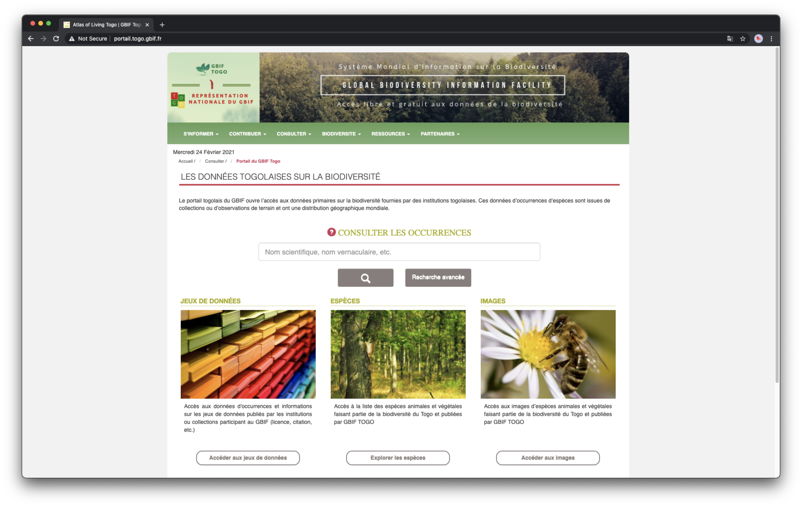

## {{ page.institution }}

#### Description 
The GBIF Togo portal is still on process of installation

It will be a Hub of the data portal of the GBIF France.

The development will be an coordination between one agent of the GBIF France team and one of the GBIF Togo.

#### Resources

- Code: ?
- End-User documentation:  ?
- Documentation: ?
- Twitter Account: ?

#### Modules Available 

| Name              | Link                                                                       | 
| ------------------|----------------------------------------------------------------------------|

For more information, you may contact ? on Slack.
