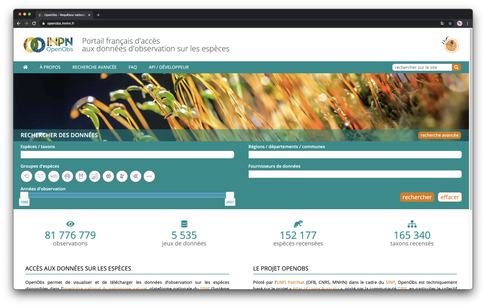

## {{ page.institution }}

#### Description 
Add description

#### Resources

- Code: ?
- Documentation: ?
- End-user documentation: ?
- Twitter Account: ?

#### Modules Available 

| Name              | Link                                                          | 
| ------------------|---------------------------------------------------------------|
| Collectory		| [http://metadonnees.gbif.fr/](http://metadonnees.gbif.fr/)    |
| Biocache          | [http://recherche.gbif.fr/](http://recherche.gbif.fr/)        |
| Biocache Service  | [http://recherche-ws.gbif.fr/](http://recherche-ws.gbif.fr/)  |
| Spatial           | [http://spatial.gbif.fr/](http://spatial.gbif.fr/)            |

For more information, you may contact Sylvain Morin on Slack.
